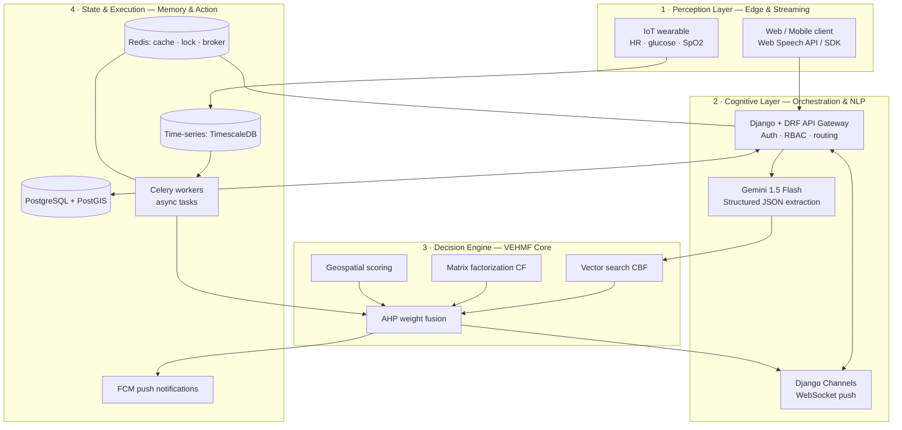
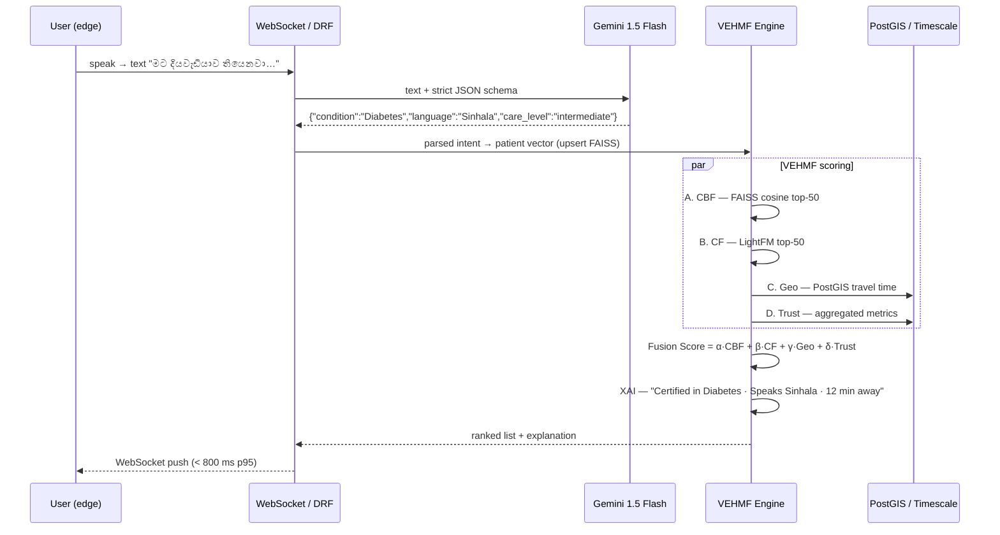
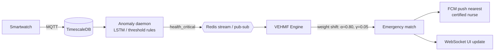
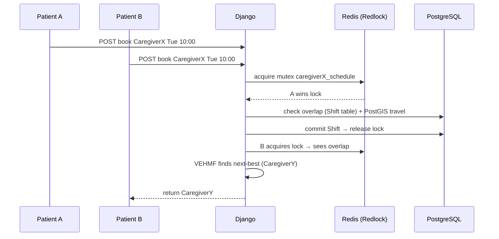
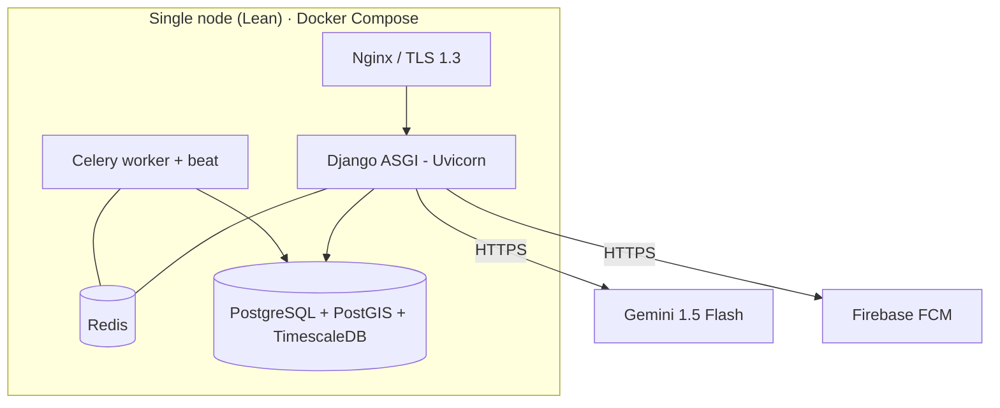

# Care Plus — System Architecture & Technical Blueprint

> **Status:** Pre-development design document (v0.1)
> **Purpose:** The single source of truth for *what* Care Plus is, *how* the layers
> interact at the memory/network level, and the *exact data flows* that connect the
> Hybrid Voice NLP, the VEHMF matching engine, and the real-time health monitors.
> **Design priorities (in order):** correctness → **latency (speed)** → **resource efficiency** → research completeness.

---

## Table of Contents

1. [Product Summary](#1-product-summary)
2. [Design Principles & Non-Functional Targets](#2-design-principles--non-functional-targets)
3. [The 4-Layer AI Brain (Conceptual Architecture)](#3-the-4-layer-ai-brain-conceptual-architecture)
4. [Technology Stack — Two Profiles (Lean vs. Full)](#4-technology-stack--two-profiles-lean-vs-full)
5. [Deep-Dive: Technology & Framework Mapping](#5-deep-dive-technology--framework-mapping)
6. [Core Data Flows](#6-core-data-flows)
7. [The VEHMF Engine (Code-Level Design)](#7-the-vehmf-engine-code-level-design)
8. [Data Model & Storage Design](#8-data-model--storage-design)
9. [API & Realtime Contract](#9-api--realtime-contract)
10. [Security, Compliance & Governance](#10-security-compliance--governance)
11. [Performance & Resource Budget](#11-performance--resource-budget)
12. [Deployment Topology](#12-deployment-topology)
13. [Phased Delivery Roadmap](#13-phased-delivery-roadmap)
14. [Repository Layout](#14-repository-layout)
15. [Open Decisions](#15-open-decisions)

---

## 1. Product Summary

**Care Plus** is a research-grade, data-driven AI ecosystem that matches **patients** with
**caregivers** using multilingual (Sinhala / Tamil / English) **voice input**, a hybrid
recommendation engine (**VEHMF**), and **real-time health monitoring** that can re-rank
matches dynamically during medical anomalies.

Three capabilities define the research contribution:

| # | Capability | One-line description |
|---|------------|----------------------|
| 1 | **Hybrid Voice → Match** | A spoken Sinhala sentence becomes a mathematically ranked, *explainable* list of caregivers. |
| 2 | **Health Anomaly → Re-Match** | Wearable time-series triggers dynamic weight shifts so medical fit overrides logistics in emergencies. |
| 3 | **Concurrency-safe Scheduling** | Distributed locking guarantees no double-booking under simultaneous requests. |

---

## 2. Design Principles & Non-Functional Targets

| Principle | Rationale | Concrete target |
|-----------|-----------|-----------------|
| **Latency first** | It is a live voice/health product. | Voice→ranked list **< 800 ms p95**; health alert fan-out **< 1 s**. |
| **Resource efficiency** | Runs on a single modest node during research; cost matters. | Whole lean stack fits in **≤ 4 GB RAM + 2 vCPU**; no GPU required at runtime. |
| **Modular, not prematurely distributed** | Microservices add ops + memory overhead that a research project rarely needs. | Start as a **modular monolith**; split *only* the VEHMF engine when it becomes CPU-bound. |
| **Explainability (XAI)** | Health decisions must be justifiable and auditable. | Every match ships a human-readable "why". |
| **Compliance by design** | GDPR / HIPAA / Sri Lanka PDPA. | Consent gate + encryption-at-rest + immutable audit trail. |
| **Reproducibility** | It is research. | Deterministic seeds, pinned deps, versioned model artifacts. |

> **Architect's note on "speed + efficiency":** The original blueprint (FAISS-HNSW +
> InfluxDB + RabbitMQ + Redis + PostGIS + LightFM + microservices) is the *textbook full*
> design. It is powerful but heavy for a research MVP. This document therefore defines a
> **Lean profile** (recommended to start) and a **Full profile** (the north-star), and
> makes the trade-off explicit at every layer. See [§4](#4-technology-stack--two-profiles-lean-vs-full).

---

## 3. The 4-Layer AI Brain (Conceptual Architecture)



| Layer | Domain of computation | Why it exists |
|-------|-----------------------|---------------|
| **Perception** | Capture unstructured audio at the edge + stream biometrics from wearables. | Keep raw data ingestion off the critical path. |
| **Cognitive** | Turn speech → structured vectors; route requests; manage realtime channels. | Convert messy human input into typed, DB-shaped data. |
| **Decision (VEHMF)** | Fuse vectors via similarity search, matrix factorization, and geo math. | The research heart: compute *explainable compatibility*. |
| **State & Execution** | WebSocket state, time-series logs, distributed locks, async dispatch. | Durable memory + safe side effects. |

---

## 4. Technology Stack — Two Profiles (Lean vs. Full)

The **Lean profile** is what we build first: fewer moving parts, one primary datastore,
no GPU, everything on one box. The **Full profile** is the research north-star you scale
into once the concept is proven.

| Concern | **Lean profile (start here)** | **Full profile (north-star)** | Why the lean choice is cheaper/faster |
|--------|------------------------------|------------------------------|----------------------------------------|
| Web / API | Django 4.2 + DRF + Channels | same | — |
| ASR (voice→text) | **Client Web Speech API**, fallback **faster-whisper (CTranslate2, int8)** | Fine-tuned Whisper-small Sinhala on GPU | Web Speech is free & instant; faster-whisper is ~4× faster and lower-RAM than raw `transformers` Whisper. |
| NLP extraction | Gemini 1.5 Flash (structured JSON) | same + local fallback | Flash is low-latency and removes regex parsing. |
| Vector search (CBF) | **FAISS `IndexFlatIP`** (or NumPy) in-process | FAISS **HNSW** in a dedicated service | For <100k profiles, flat exact search is sub-ms and needs no tuning. |
| Collaborative filtering | **implicit ALS** or LightFM (retrained offline) | LightFM online + warm cache | Small models; retrain as a nightly Celery job, not per-request. |
| Weights | AHP eigenvector via NumPy at startup | same, periodically re-surveyed | — |
| Relational + Geo | **PostgreSQL + PostGIS** | same | — |
| Time-series | **TimescaleDB (Postgres extension)** | InfluxDB (separate cluster) | TimescaleDB reuses the *same* Postgres instance → one DB to run, back up, secure. |
| Cache / Lock / Broker | **Redis** (does all three) | Redis (cache/lock) **+ RabbitMQ** (broker) | One Redis replaces Redis+RabbitMQ → saves a whole service + RAM. |
| Async tasks | Celery (Redis broker) | Celery (RabbitMQ broker) | — |
| Push | Firebase Cloud Messaging | same | — |
| Topology | **Modular monolith** (VEHMF = in-process module) | Independent Python microservices | No inter-service network hops, no serialization overhead, one deploy. |

> **Rule of thumb applied throughout:** *add a service only when a measured bottleneck
> demands it.* Every process you run costs RAM, ops time, and a network hop of latency.

---

## 5. Deep-Dive: Technology & Framework Mapping

### A. Backend Orchestrator — Django + DRF + Channels
- **Role:** API Gateway, State Manager, ORM. Handles JWT auth, RBAC, request routing.
- **Network level:** Django Channels upgrades HTTP → WebSocket over an **ASGI** server
  (Uvicorn/Daphne). Enables *server push* of health alerts & match updates — no HTTP polling.
- **Efficiency note:** Run one ASGI process with multiple workers; Channels layer backed by Redis pub/sub.

### B. Cognitive Layer — Hybrid Gemini Pipeline ⭐
- **Hearing (ASR):** client `Web Speech API` (or mobile SDK) streams audio → instant text.
  Server-side fallback = `faster-whisper` for uploaded files / unsupported browsers.
- **Understanding (NLP):** transcribed text → **Gemini 1.5 Flash** with
  `response_mime_type="application/json"` + a strict JSON schema in the system prompt.
  Gemini is *forced* to return valid JSON that maps 1:1 to Django models.
- **Advantage:** no fragile regex; handles Sinhala/Tamil medical slang natively; NLP latency drops from seconds → ms.

**Contract example**

```json
// Gemini system prompt enforces this schema:
{
  "condition": "Diabetes",
  "language": "Sinhala",
  "care_level": "intermediate",
  "urgency": "routine",
  "raw_text": "මට දියවැඩියාව තියෙනවා, සිංහල කතා කරන කෙනෙක් ඕන."
}
```

### C. Decision Engine — VEHMF (research core)
- **Vector DB (CBF):** FAISS. Profiles → high-dim vectors (e.g. 768-d). Loaded into RAM;
  nearest neighbors in sub-ms. *Lean:* `IndexFlatIP` (exact cosine). *Full:* HNSW graph index.
- **Matrix Factorization (CF):** LightFM / implicit-ALS. Latent User-Item matrix learns hidden
  patterns ("patients with X rate caregivers with Y highly") without manual feature engineering.
- **AHP Weight Optimizer:** NumPy/SciPy computes the **principal eigenvector** of the stakeholder
  survey matrix at startup → injects empirical weights `[α, β, γ, δ]` into the scoring function.

### D. State & Execution — Geospatial & Time-Series
- **Geospatial:** PostGIS stores `POINT(lat, lng)`, uses R-Tree (GiST) indexing to compute real
  travel distance/time, not straight-line Euclidean.
- **Time-series:** TimescaleDB (or InfluxDB) uses append-optimized storage (hypertables / LSM)
  to ingest millions of IoT points and run time-window aggregations efficiently.
- **Cache/Broker:** Redis for caching, **Redlock** distributed locks, and Celery message brokering.

---

## 6. Core Data Flows

### FLOW 1 — Hybrid Voice-to-Match Pipeline (the core research flow)



### FLOW 2 — Real-Time Health Anomaly → Dynamic Re-Matching



**Key idea:** in an emergency the engine *dynamically re-weights* AHP factors so medical
expertise dominates and logistics is de-prioritized, then bypasses normal ranking.

### FLOW 3 — Async Scheduling & Race-Condition Prevention



---

## 7. The VEHMF Engine (Code-Level Design)

The engine is an **in-memory graph & matrix computation** unit. In the Lean profile it is a
Python **module** imported by Django/Celery; in the Full profile it is promoted to a
standalone service behind gRPC/HTTP — the class contract stays identical.

```python
# vehmf/engine.py — conceptual design (Lean: in-process module)
import numpy as np

class VEHMFEngine:
    def __init__(self, ahp_weights, faiss_index, cf_model, geo_repo, trust_repo):
        self.W = np.asarray(ahp_weights, dtype="float32")  # [α, β, γ, δ]
        self.index = faiss_index          # in-memory CBF vector index
        self.cf_model = cf_model          # matrix-factorization model (offline-trained)
        self.geo = geo_repo               # PostGIS-backed travel scoring
        self.trust = trust_repo           # aggregated performance metrics

    def predict(self, patient_vector, patient_id, candidates, weights=None):
        W = np.asarray(weights, dtype="float32") if weights is not None else self.W

        # 1. CBF — content-based (vector space, cosine via inner product on L2-normed vecs)
        p = patient_vector.reshape(1, -1).astype("float32")
        cbf_sim, cbf_idx = self.index.search(p, 100)
        cbf = self._normalize(cbf_sim.ravel())

        # 2. CF — collaborative (latent factor prediction)
        cf = self._normalize(self.cf_model.predict(patient_id, candidates))

        # 3. Geo — travel-time → 0..1 (closer = higher)
        geo = self.geo.travel_time_scores(patient_id, candidates)

        # 4. Trust — reviews, completion rate, certifications
        trust = self.trust.scores(candidates)

        # 5. FUSION — Score = Wᵀ · [CBF, CF, Geo, Trust]
        score_matrix = np.column_stack((cbf, cf, geo, trust))   # (N, 4)
        final = score_matrix @ W                                # (N,)

        # 6. XAI — dominant contributing factor for the top match
        top = int(np.argmax(final))
        contributor = int(np.argmax(score_matrix[top] * W))
        return final, self._xai(contributor, candidates[top])

    @staticmethod
    def _normalize(x):
        x = np.asarray(x, dtype="float32")
        rng = np.ptp(x)
        return (x - x.min()) / rng if rng else np.zeros_like(x)

    def _xai(self, factor, caregiver):
        reason = {0: "strong medical/skill match",
                  1: "highly rated by similar patients",
                  2: "very close / short travel time",
                  3: "high trust & completion record"}[factor]
        return f"Matched because: {reason}."
```

**Dynamic weights (Flow 2):** an emergency simply calls `predict(..., weights=[0.80, 0.05, 0.05, 0.10])`.
Weights are validated to be non-negative and sum-normalized before use.

**Efficiency notes**
- Keep vectors **L2-normalized** so inner product == cosine → `IndexFlatIP` is exact & fast.
- **Retrain CF offline** (nightly Celery beat), never in the request path.
- Cache `geo`/`trust` scores in Redis with short TTLs; they change slowly.

---

## 8. Data Model & Storage Design

**One PostgreSQL instance** (with PostGIS + TimescaleDB extensions) is the Lean primary store.

```mermaid
erDiagram
    USER ||--o| PATIENT_PROFILE : has
    USER ||--o| CAREGIVER_PROFILE : has
    PATIENT_PROFILE ||--o{ VOICE_REQUEST : creates
    VOICE_REQUEST ||--|| MATCH_RESULT : yields
    CAREGIVER_PROFILE ||--o{ SHIFT : books
    PATIENT_PROFILE ||--o{ SHIFT : reserves
    PATIENT_PROFILE ||--o{ HEALTH_METRIC : streams
    USER ||--o{ CONSENT_LOG : signs
    USER ||--o{ AUDIT_LOG : triggers

    CAREGIVER_PROFILE {
        uuid id PK
        geometry(Point,4326) location
        string[] certifications
        string[] languages
        float trust_score
        vector embedding
    }
    HEALTH_METRIC {
        uuid patient_id FK
        timestamptz ts
        string metric
        float value
    }
    CONSENT_LOG {
        uuid user_id FK
        string scope
        bool granted
        timestamptz ts
    }
```

| Store | Holds | Index | Profile |
|-------|-------|-------|---------|
| PostgreSQL | users, profiles, shifts, match results | B-tree | both |
| PostGIS (ext) | caregiver/patient `POINT` locations | GiST (R-Tree) | both |
| TimescaleDB (ext) | `HEALTH_METRIC` hypertable | time + patient | Lean |
| InfluxDB | same, separated | TSM | Full only |
| FAISS (RAM) | profile embeddings | Flat / HNSW | both |
| Redis | cache, Redlock, Celery broker, Channels layer | — | both |

- **Encryption at rest:** `pgcrypto` AES-256 on health-condition and transcribed-intent columns.
- **Audit table:** append-only, no `UPDATE`/`DELETE` grants for app role.

---

## 9. API & Realtime Contract

REST (DRF) for CRUD + command; **WebSocket** (Channels) for realtime push.

| Method | Path | Purpose |
|--------|------|---------|
| `POST` | `/api/v1/auth/token` | JWT obtain/refresh |
| `POST` | `/api/v1/voice/intent` | text → Gemini → structured intent (consent-gated) |
| `POST` | `/api/v1/match` | run VEHMF → ranked caregivers + XAI |
| `POST` | `/api/v1/shifts` | book (Redlock-protected) |
| `GET`  | `/api/v1/health/{patient}/summary` | time-window aggregates |
| `POST` | `/api/v1/consent` | grant/revoke processing scopes |

| WS channel | Direction | Payload |
|------------|-----------|---------|
| `ws/match/{patient}` | server→client | ranked list + explanation |
| `ws/alerts/{patient}` | server→client | `health_critical`, re-match |

**Standard match response**

```json
{
  "request_id": "…",
  "latency_ms": 612,
  "results": [
    {"caregiver_id": "…", "score": 0.91,
     "breakdown": {"cbf": 0.88, "cf": 0.74, "geo": 0.95, "trust": 0.90},
     "explanation": "Certified in Diabetes · Speaks Sinhala · 12 min away"}
  ]
}
```

---

## 10. Security, Compliance & Governance

| Control | Mechanism |
|--------|-----------|
| **Data at rest** | `pgcrypto` AES-256 on health/intent columns. |
| **Data in transit** | TLS 1.3 on all REST + WebSocket. |
| **Consent gate (PDPA/GDPR)** | Before Gemini processes a voice note, Django checks `ConsentLog`. No consent → pipeline blocked *before* any external API call. |
| **AuthZ** | JWT + RBAC (patient / caregiver / admin / auditor). |
| **Audit trail (HIPAA/PDPA)** | Every health-data view → Celery task writes immutable row `{actor, action, ts(UTC), ip}`. |
| **PII minimization** | Send only the minimal text to Gemini; strip identifiers; region-pin the API where possible. |
| **Right to erasure** | Soft-delete + scheduled purge job; embeddings evicted from FAISS on erasure. |

---

## 11. Performance & Resource Budget

**Latency budget for Flow 1 (target p95 < 800 ms):**

| Stage | Budget |
|-------|--------|
| Client ASR (Web Speech) | ~0 ms server (edge) |
| Network → Django | 30 ms |
| Gemini 1.5 Flash | 250–400 ms |
| FAISS CBF (flat, <100k) | < 5 ms |
| CF predict (cached model) | < 10 ms |
| PostGIS geo | 20–60 ms |
| Fusion + XAI (NumPy) | < 5 ms |
| WS push | 20 ms |
| **Total** | **≈ 350–520 ms** (headroom to 800) |

**Lean resource footprint (single node):**

| Component | RAM (approx) |
|-----------|--------------|
| Django ASGI + workers | 300–500 MB |
| PostgreSQL (+PostGIS+Timescale) | 500 MB–1 GB |
| Redis | 100–300 MB |
| FAISS flat (50k × 768 f32) | ~150 MB |
| Celery worker | 200–400 MB |
| faster-whisper (int8, on demand) | 400–700 MB |
| **Total** | **≈ 2–3.5 GB** → fits 4 GB / 2 vCPU |

---

## 12. Deployment Topology



- **Lean:** one `docker-compose.yml`; VEHMF is a package inside the Django app.
- **Full:** split `vehmf-service`, add RabbitMQ + InfluxDB, front with a load balancer, move to k8s.

---

## 13. Phased Delivery Roadmap

| Phase | Goal | Ships | Exit criteria |
|-------|------|-------|---------------|
| **0 · Foundations** | Repo + skeleton | Django+DRF+Channels scaffold, Docker Compose, PostGIS/Timescale, auth, CI, this doc | `docker compose up` works, health check green |
| **1 · Voice→Intent** | Cognitive layer | Web Speech client, `/voice/intent`, Gemini structured output, consent gate | Sinhala sentence → validated JSON in DB |
| **2 · VEHMF v1** | Core research flow | FAISS flat CBF + AHP fusion + geo + XAI, `/match`, WS push | Ranked+explained list < 800 ms |
| **3 · CF + tuning** | Personalization | LightFM/implicit offline training, blend into fusion | CF improves offline ranking metric |
| **4 · Health monitoring** | Flow 2 | Timescale ingest, anomaly daemon, dynamic re-weight, FCM | Simulated anomaly → emergency re-match |
| **5 · Scheduling** | Flow 3 | Redlock booking, shift overlap, fallback re-match | No double-book under concurrent load test |
| **6 · Compliance & hardening** | Governance | pgcrypto, audit trail, erasure, TLS, RBAC review | Compliance checklist passes |
| **7 · Scale (optional)** | Full profile | Extract VEHMF service, HNSW, RabbitMQ/Influx | Meets scaled load targets |

---

## 14. Repository Layout

Monorepo (pnpm workspaces + Turborepo). Frontend/mobile detail lives in
[FRONTEND.md](FRONTEND.md#13-repository-layout-frontendmobile).

```
care-plus/
├── docs/
│   ├── ARCHITECTURE.md          # this file (backend + system)
│   ├── FRONTEND.md              # web + mobile + design system + AI assistant
│   └── decisions/               # ADRs (architecture decision records)
├── backend/
│   ├── careplus/                # Django project (settings, asgi, urls)
│   ├── apps/
│   │   ├── accounts/            # auth, RBAC, consent, audit
│   │   ├── voice/               # ASR fallback + Gemini intent extraction
│   │   ├── matching/            # VEHMF module (engine, faiss, ahp, xai)
│   │   ├── health/              # timescale ingest, anomaly daemon
│   │   └── scheduling/          # shifts, Redlock booking
│   ├── requirements.txt
│   └── manage.py
├── ml/
│   ├── train_cf.py              # offline collaborative-filtering training
│   ├── build_index.py           # embedding + FAISS index build
│   └── ahp.py                   # eigenvector weight solver
├── apps/
│   ├── web/                     # Vite + React 18 + TS (SPA, Neural Core)
│   └── mobile/                  # Expo + React Native + TS (Android + iOS)
├── packages/
│   ├── ui-tokens/               # shared design tokens (Aurora Neural theme)
│   ├── api-client/              # typed REST + WS client, Zod schemas
│   └── core/                    # assistant FSM, i18n, formatting
├── infra/
│   └── docker-compose.yml
├── turbo.json / pnpm-workspace.yaml
└── README.md
```

---

## 15. Open Decisions

Resolved (this iteration):

- ✅ **Frontend:** **both** — React 18 + TS web (SPA) **and** Expo React Native (Android + iOS), in a monorepo. Full plan in [FRONTEND.md](FRONTEND.md).
- ✅ **Theme:** **"Aurora Neural"** dark holographic sci-fi with the audio-reactive **Neural Core** voice assistant.

Still to confirm before/while building (see `docs/decisions/`):

1. **ASR default:** rely on client Web Speech API / on-device voice, or always run server `faster-whisper`?
2. **CF library:** LightFM vs `implicit` (ALS) — LightFM supports hybrid features but heavier.
3. **Time-series:** confirm TimescaleDB (lean, one DB) vs InfluxDB (full, separate).
4. **Embedding source:** which model produces the 768-d profile vectors (multilingual sentence-transformer)?
5. **Hosting:** single VM (lean) target provider & region (data-residency for PDPA).

> Answer these and I will generate the Phase 0 scaffold (backend + monorepo frontend) accordingly.
