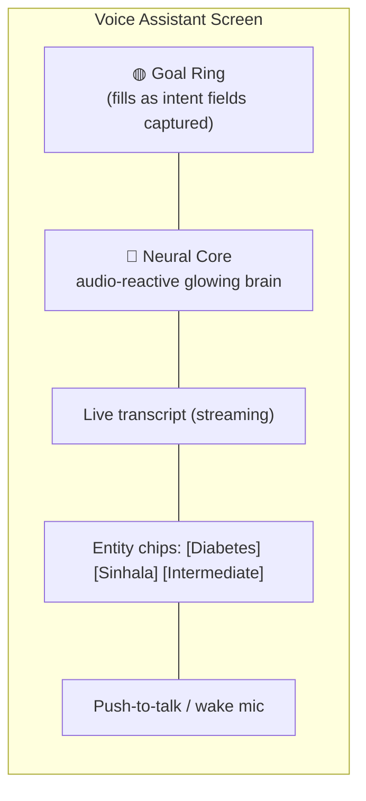
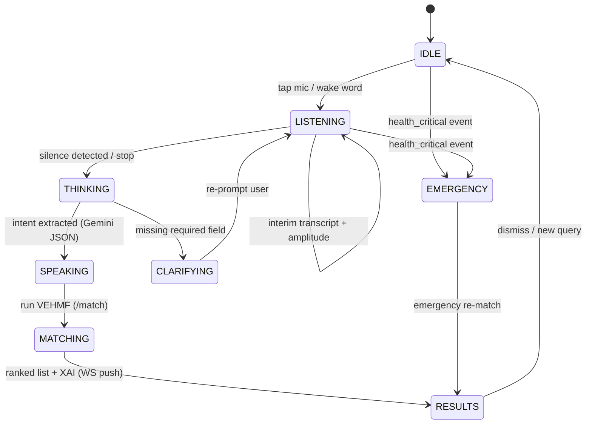
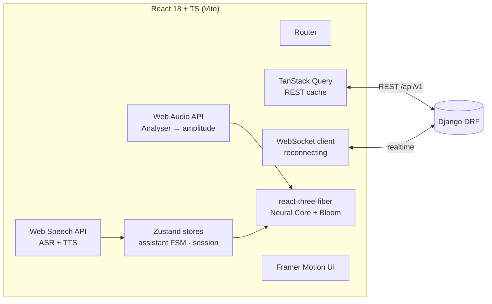
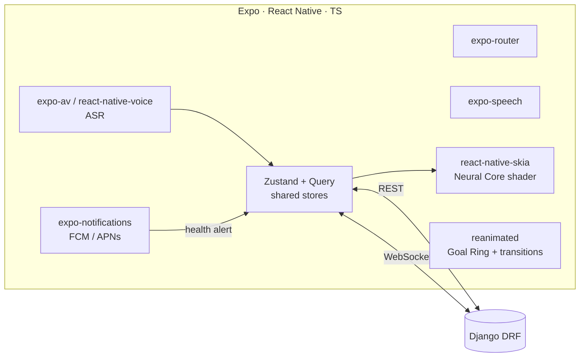

# Care Plus — Frontend & Mobile Blueprint

> **Status:** Pre-development design (v0.1) — companion to [ARCHITECTURE.md](ARCHITECTURE.md).
> **Scope:** The **web app**, the **cross-platform mobile app (Android + iOS)**, the shared
> **design system**, and the signature **"Neural Core" realtime AI voice-assistant interface**.
> **Priorities:** immersive sci-fi UX → realtime responsiveness → resource efficiency (must stay smooth on mid-range phones and integrated GPUs).

---

## Table of Contents

1. [Platform Decisions (and why)](#1-platform-decisions-and-why)
2. [The "Aurora Neural" Design System](#2-the-aurora-neural-design-system)
3. [The Neural Core — Realtime AI Voice Assistant](#3-the-neural-core--realtime-ai-voice-assistant)
4. [Assistant State Machine & Realtime Feedback](#4-assistant-state-machine--realtime-feedback)
5. [Web App Architecture](#5-web-app-architecture)
6. [Mobile App Architecture](#6-mobile-app-architecture)
7. [Shared Layer (Monorepo)](#7-shared-layer-monorepo)
8. [Screen Inventory (by role)](#8-screen-inventory-by-role)
9. [Realtime Data Contract (client view)](#9-realtime-data-contract-client-view)
10. [Performance & Resource Efficiency Rules](#10-performance--resource-efficiency-rules)
11. [Accessibility & Localization](#11-accessibility--localization)
12. [Frontend Delivery Roadmap](#12-frontend-delivery-roadmap)
13. [Repository Layout (frontend/mobile)](#13-repository-layout-frontendmobile)

---

## 1. Platform Decisions (and why)

| Question                            | Decision                                                                                                      | Rationale                                                                                                                                                                                                                                                |
| ----------------------------------- | ------------------------------------------------------------------------------------------------------------- | -------------------------------------------------------------------------------------------------------------------------------------------------------------------------------------------------------------------------------------------------------- |
| **Web: Django templates vs React?** | **React 18 + TypeScript (Vite)**. Django stays a pure JSON/WebSocket API.                                     | The signature interface needs 3D/WebGL, audio-reactive shaders, spring physics and streaming state. Django templates + server-rendered HTML cannot drive a 60 fps audio-reactive brain or fine-grained realtime UI. A SPA + WebSocket is the right tool. |
| **Mobile: framework?**              | **React Native + TypeScript via Expo (managed workflow)**.                                                    | One TS codebase → Android **and** iOS. Expo gives OTA updates, push (FCM/APNs), audio, and native builds without heavy native tooling. Confirms your instinct (TS/JS + RN).                                                                              |
| **Web ↔ Mobile code sharing?**     | **Monorepo (pnpm workspaces + Turborepo)**. Share design tokens, typed API client, Zod schemas, state stores. | Write the API/validation/theme once; only the _rendering_ layer differs (DOM vs native).                                                                                                                                                                 |
| **3D on web**                       | `react-three-fiber` + `drei` + `@react-three/postprocessing` (Bloom).                                         | Declarative Three.js in React; GPU bloom gives the "glow" cheaply.                                                                                                                                                                                       |
| **3D/glow on mobile**               | `@shopify/react-native-skia` + `react-native-reanimated`.                                                     | Skia runs shaders/particles on the GPU on-device without a full 3D engine → battery-friendly.                                                                                                                                                            |
| **State**                           | **Zustand** (UI/assistant state) + **TanStack Query** (server state).                                         | Tiny, fast, no boilerplate; Query handles caching/retries for REST.                                                                                                                                                                                      |
| **Styling (web)**                   | **Tailwind CSS** driven by shared design tokens.                                                              | Fast to build a consistent themed UI; purged CSS keeps bundle small.                                                                                                                                                                                     |
| **Animation (web UI)**              | **Framer Motion**.                                                                                            | Physics-based transitions for the "living" feel.                                                                                                                                                                                                         |

> **Net:** Django = brain-stem (API, auth, VEHMF, data). React/React-Native = the face and senses.

---

## 2. The "Aurora Neural" Design System

A dark, holographic, sci-fi medical theme — calm and trustworthy, not gamer-loud.

### Palette (design tokens)

| Token           | Hex                      | Use                                |
| --------------- | ------------------------ | ---------------------------------- |
| `bg/void`       | `#05060A`                | App background (deep space)        |
| `bg/panel`      | `rgba(18,22,34,0.6)`     | Glassmorphic cards (blur + border) |
| `border/hair`   | `rgba(148,163,184,0.14)` | 1px panel edges                    |
| `accent/cyan`   | `#22D3EE`                | Primary — listening, links, focus  |
| `accent/violet` | `#8B5CF6`                | Cognition — thinking / AI          |
| `accent/mint`   | `#34D399`                | Success / positive match           |
| `accent/amber`  | `#F59E0B`                | Warning                            |
| `accent/rose`   | `#FB7185`                | Emergency / health-critical        |
| `text/primary`  | `#E5EDFF`                | Body text                          |
| `text/muted`    | `#8A94AD`                | Secondary text                     |

### Language

- **Glassmorphism** panels floating over a subtle animated star/nebula gradient.
- **Neon rim-light** + soft **bloom** on interactive elements.
- **Micro-motion everywhere:** nothing snaps; everything eases (spring, 200–400 ms).
- **Typography:** display = _Space Grotesk_ / _Sora_; body = _Inter_; Sinhala/Tamil = _Noto Sans Sinhala/Tamil_ (co-registered so mixed-script text never breaks).
- **Iconography:** thin-line, rounded (Lucide).
- **Motion tokens:** `spring.soft = {stiffness:180, damping:22}`, durations `fast 150 / base 260 / slow 420`.

> Tokens live once in `packages/ui-tokens` and are consumed by both Tailwind (web) and the RN theme (mobile).

---

## 3. The Neural Core — Realtime AI Voice Assistant

The centerpiece on the home/voice screen of **both** web and mobile: a **living, glowing brain**
that reacts to your voice in real time and visibly "thinks", with a **Goal Ring** and streaming feedback.



### Anatomy

1. **Neural Core (the brain):** a low-poly icosphere/point-cloud "neural mesh" of nodes + synapse
   lines. Its **scale, emissive intensity, and color pulse** are driven live by microphone
   amplitude (Web Audio `AnalyserNode` on web; audio metering on mobile). Idle = slow breathing;
   speech = reactive pulsing.
2. **Goal Ring:** a circular progress arc around the brain. The assistant needs a few fields to
   match (`condition`, `language`, `care_level`, optional `urgency`). Each captured field fills a
   segment of the ring → the user _sees the goal being reached_. Full ring = "ready to match".
3. **Live transcript:** streamed words appear as you speak (from Web Speech interim results).
4. **Entity chips:** as Gemini extracts structured intent, chips pop in with a spring + glow,
   color-coded (medical = cyan, language = violet, level = mint).
5. **Ambient synapse particles:** subtle background firing that intensifies during "thinking".

### Color = state (instant legibility)

- Cyan pulse = **listening**, violet swirl = **thinking**, mint glow = **results ready**,
  rose flash = **emergency** (wired to the health-anomaly flow so the brain literally "alarms").

---

## 4. Assistant State Machine & Realtime Feedback

A single finite-state machine drives visuals, audio, haptics (mobile), and copy. Kept in a
Zustand store shared across platforms.



| State        | Brain visual                 | UI feedback                       | Copy example                        |
| ------------ | ---------------------------- | --------------------------------- | ----------------------------------- |
| `IDLE`       | dim slow breathing           | "Tap to speak" hint               | —                                   |
| `LISTENING`  | cyan, amplitude-reactive     | live transcript, mic ring         | "Listening…"                        |
| `THINKING`   | violet swirl, particles fire | shimmer skeleton                  | "Understanding…"                    |
| `CLARIFYING` | soft violet pulse            | highlight empty Goal-Ring segment | "Which language do you prefer?"     |
| `SPEAKING`   | warm glow + waveform         | TTS plays; caption shown          | reads extracted intent back         |
| `MATCHING`   | fast orbit                   | Goal Ring 100%, spinner           | "Finding your best match…"          |
| `RESULTS`    | recedes to corner, mint      | result cards slide in with XAI    | "3 matches. Top: 12 min away."      |
| `EMERGENCY`  | rose flash + fast pulse      | full-screen alert, call button    | "Health alert — dispatching nurse." |

**Realtime feedback channels**

- **Transcript:** Web Speech interim results → transcript component (no server round-trip).
- **Entities:** `/voice/intent` response → chips + Goal-Ring fill.
- **Match:** WebSocket `ws/match/{patient}` → result cards + `latency_ms` badge (shows the "< 800 ms" promise).
- **Alerts:** WebSocket `ws/alerts/{patient}` → EMERGENCY transition.

---

## 5. Web App Architecture



**Stack:** Vite · React 18 · TypeScript · Tailwind · Framer Motion · react-three-fiber + drei + postprocessing · Zustand · TanStack Query · `reconnecting-websocket` · Zod (shared schemas) · react-hook-form.

**Key modules**

- `neural-core/` — R3F scene, audio-reactive shader material, bloom, `frameloop="demand"` when idle.
- `assistant/` — FSM store, mic controller, transcript, entity chips, Goal Ring.
- `realtime/` — WS client + typed event handlers (match, alerts).
- `features/` — matching, scheduling, health-dashboard (charts via `visx`/`recharts`), consent.
- `auth/` — JWT storage (httpOnly cookie preferred), RBAC-aware routing.

---

## 6. Mobile App Architecture (Android + iOS)



**Stack:** Expo (managed) · React Native · TypeScript · expo-router · `@shopify/react-native-skia` · react-native-reanimated + gesture-handler · react-native-voice (ASR) · expo-speech (TTS) · expo-notifications (push) · Zustand + TanStack Query (shared).

**Native concerns**

- **Voice:** `react-native-voice` for on-device ASR incl. Sinhala/Tamil where supported; fallback = record + upload to server `faster-whisper`.
- **Neural Core:** Skia particle/shader canvas driven by audio meter values + Reanimated shared values → runs on the UI thread for 60 fps without JS-bridge jank.
- **Push:** FCM (Android) + APNs (iOS) via `expo-notifications`, wired to Flow 2 health alerts.
- **Offline:** cache last match + schedule with Query persistence; graceful degrade.
- **Low-end devices:** Skia scene auto-reduces particle count; disable bloom on old GPUs.

---

## 7. Shared Layer (Monorepo)

```
apps/        web (Vite React)   ·   mobile (Expo RN)
packages/    ui-tokens          ·   api-client          ·   core
```

| Package               | Contents                                                                                               | Shared by    |
| --------------------- | ------------------------------------------------------------------------------------------------------ | ------------ |
| `packages/ui-tokens`  | colors, spacing, motion, typography tokens                                                             | web + mobile |
| `packages/api-client` | typed REST client, WebSocket client, **Zod** request/response schemas (mirror Django/Gemini contracts) | web + mobile |
| `packages/core`       | assistant FSM logic, intent/Goal-Ring rules, formatting, i18n strings                                  | web + mobile |

Only rendering differs (DOM/Three.js vs RN/Skia). Business logic, validation, and theme are written once.

---

## 8. Screen Inventory (by role)

### Patient (web + mobile)

1. **Onboarding & Consent** — PDPA/GDPR consent toggles gate AI voice processing (ties to `ConsentLog`).
2. **Voice Assistant (Home)** — the Neural Core experience.
3. **Match Results** — ranked cards with score breakdown + XAI ("why matched").
4. **Caregiver Detail** — certifications, languages, distance/ETA, reviews, book CTA.
5. **Scheduling / Bookings** — calendar, Redlock-safe booking, fallback match on conflict.
6. **Health Dashboard** — time-series charts (HR, glucose), trends, anomaly markers.
7. **Alerts** — emergency history + live critical alerts.
8. **Profile & Settings** — language, privacy, data export/erasure.

### Caregiver (web + mobile)

1. **Dashboard** — today's shifts, incoming requests.
2. **Incoming Requests** — accept/decline matched patients.
3. **Schedule** — shift calendar, availability.
4. **Patient Health View** — audited access (every view logged for HIPAA/PDPA).
5. **Profile & Certifications** — verifiable credentials, languages, service area (map/PostGIS).

### Admin / Auditor (web only)

1. **Audit Log Explorer** — immutable access trail.
2. **AHP Weight Console** — view/re-run `[α, β, γ, δ]` eigenvector weights.
3. **System Monitoring** — match latency, anomaly events, model health.

---

## 9. Realtime Data Contract (client view)

Mirrors [ARCHITECTURE.md §9](ARCHITECTURE.md#9-api--realtime-contract); Zod schemas in `packages/api-client`.

```ts
// packages/api-client/schemas.ts (conceptual)
export const Intent = z.object({
  condition: z.string(),
  language: z.enum(['Sinhala', 'Tamil', 'English']),
  care_level: z.enum(['basic', 'intermediate', 'advanced']),
  urgency: z.enum(['routine', 'urgent', 'critical']).default('routine'),
  raw_text: z.string(),
});

export const MatchResult = z.object({
  request_id: z.string(),
  latency_ms: z.number(),
  results: z.array(
    z.object({
      caregiver_id: z.string(),
      score: z.number(),
      breakdown: z.object({ cbf: z.number(), cf: z.number(), geo: z.number(), trust: z.number() }),
      explanation: z.string(),
    }),
  ),
});

// WebSocket events the assistant reacts to
type WsEvent =
  | { type: 'match.result'; data: MatchResult }
  | { type: 'health_critical'; patient_id: string; metric: string; value: number }
  | { type: 'rematch'; data: MatchResult };
```

The **Goal Ring** completion is computed client-side from how many required `Intent` fields are non-empty → instant visual feedback while the user is still talking.

---

## 10. Performance & Resource Efficiency Rules

Efficiency is a first-class goal (per ARCHITECTURE.md), and 3D/animation is where it's easily lost.

| Rule                    | Web                                                                          | Mobile                                               |
| ----------------------- | ---------------------------------------------------------------------------- | ---------------------------------------------------- |
| Render only when needed | R3F `frameloop="demand"`; render on audio/state change, pause in IDLE        | Skia redraws driven by Reanimated shared values only |
| Cap resolution          | `dpr={[1, 1.75]}`                                                            | reduce particle count on low RAM                     |
| Cheap glow              | single Bloom pass, low samples                                               | precomputed radial-gradient glow sprite              |
| Geometry budget         | ≤ ~2–4k points in the neural mesh                                            | ≤ ~800 particles                                     |
| Bundle size             | route-based code splitting; Three.js lazy-loaded on the assistant route only | Hermes engine + tree-shaking                         |
| Battery/thermal         | pause visualization when tab hidden                                          | pause on background / low-power mode                 |
| Graceful degrade        | if WebGL unavailable → CSS/canvas 2D pulsing orb                             | if Skia heavy → Reanimated-only orb                  |

Target: **60 fps** on a mid-range Android and an integrated-GPU laptop; the fancy visuals must never delay the actual match result.

---

## 11. Accessibility & Localization

- **Multilingual UI:** Sinhala / Tamil / English via `i18next` (web) + `expo-localization` (mobile); strings in `packages/core`.
- **Mixed-script safety:** co-registered Noto fonts so `"හයි how are you"` renders cleanly.
- **Voice-first, but not voice-only:** every voice action has a typed/tap equivalent.
- **A11y:** ARIA live-region announces assistant state changes; reduced-motion setting disables heavy animation and bloom; WCAG AA contrast on all text (theme tuned for it).
- **Captions:** TTS responses always show text captions.

---

## 12. Frontend Delivery Roadmap

Runs alongside the backend phases in [ARCHITECTURE.md §13](ARCHITECTURE.md#13-phased-delivery-roadmap).

| Phase                      | Ships                                                                           |
| -------------------------- | ------------------------------------------------------------------------------- |
| **F0 · Foundation**        | Monorepo, design tokens, Tailwind theme, auth screens, API/WS client, Storybook |
| **F1 · Neural Core MVP**   | Audio-reactive brain (web R3F + mobile Skia), FSM, mic capture, live transcript |
| **F2 · Voice→Intent UX**   | Entity chips, Goal Ring, consent gate, `/voice/intent` integration              |
| **F3 · Match experience**  | Result cards + XAI, WebSocket match push, latency badge                         |
| **F4 · Scheduling**        | Calendar, booking, conflict/fallback UX                                         |
| **F5 · Health & alerts**   | Charts, EMERGENCY state, push notifications                                     |
| **F6 · Caregiver + Admin** | Caregiver app flows, admin/audit console (web)                                  |
| **F7 · Polish**            | Motion pass, a11y, low-end degrade, store submission (Play/App Store)           |

---

## 13. Repository Layout (frontend/mobile)

```
care-plus/
├── apps/
│   ├── web/                     # Vite + React + TS (SPA)
│   │   └── src/
│   │       ├── neural-core/     # R3F scene, audio-reactive shader, bloom
│   │       ├── assistant/       # FSM, mic, transcript, chips, goal ring
│   │       ├── realtime/        # WebSocket client + handlers
│   │       ├── features/        # matching · scheduling · health · consent
│   │       └── app/             # routing, layout, theme
│   └── mobile/                  # Expo + React Native + TS
│       └── src/
│           ├── neural-core/     # Skia + Reanimated brain
│           ├── assistant/       # shared FSM bindings
│           ├── screens/         # expo-router screens
│           └── native/          # voice, push, permissions
├── packages/
│   ├── ui-tokens/               # colors, spacing, motion, typography
│   ├── api-client/              # typed REST + WS client, Zod schemas
│   └── core/                    # assistant FSM, i18n, formatting
├── backend/                     # Django (see ARCHITECTURE.md §14)
└── turbo.json / pnpm-workspace.yaml
```
